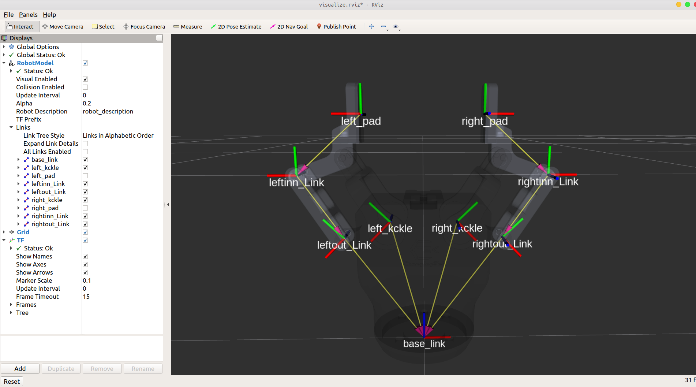
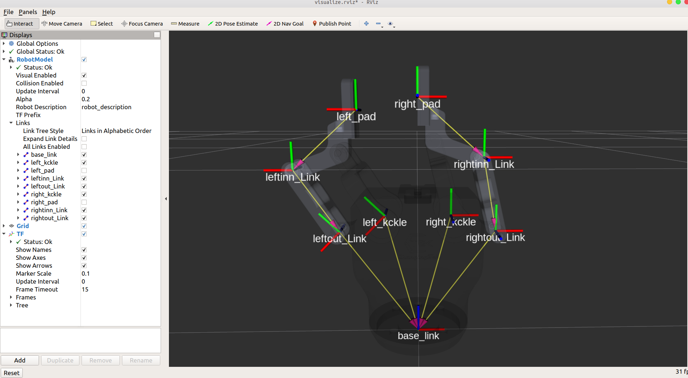

 [English](./README.md) | 简体中文

# 说明

## Tips

> 1. Rviz中使用 **joint-state-publisher-gui** 发布 **'/joint_states'** 的话题，通过节点来订阅此话题来实现实物与模型的同步
> 2. 不使用可视化时，仅启用节点，通过python代码和终端命令向话题 **'/joint_states'** 发布消息，实现实物的控制。
> 3. 如果没有显示找不到 **joint-state-publisher-gui** ，在终端中通过以下命令进行安装。
```bash
sudo apt-get install ros-melodic-joint-state-publisher-gui
```

## 环境配置
1. ubuntu18.04系统

2. ros-melodic环境

3. 把 **crt-ctm2f110-gripper-visualization** 文件包拷贝到自己的ubuntu系统工作空间的src文件夹下，执行如下语句:
```bash
cd ~/catkin_ws/
```
```bash
catkin_make
```
编译完成再执行如下语句：
```bash
source ~/catkin_ws/devel/setup.bash
```

## 运行程序

* 确定设备串口号，对其增加权限。
```bash
sudo chmod 777 <设备串口号>
```
例如
```bash
sudo chmod 777 /dev/ttyUSB0
```

* 在'scripts/gripper_listener.cpp'第29行，更新设备串口号。
```C++
gs.openSerial(115200, "<设备串口号>")
```

* 使用rviz来控制实物二指手(同步模式)，拖拽gui滑条，即可使模型与实物同步运动。
```bash
roslaunch crt_ctm2f110_gripper_visualization crt_ctm2f110_gripper_control_sync.launch
```

* 使用rviz来控制实物二指手(异步模式)，拖拽gui滑条，即可使模型与实物各指端相应同步运动。
```bash
roslaunch crt_ctm2f110_gripper_visualization crt_ctm2f110_gripper_control_async.launch
```

* 只使用rviz显示二指手URDF模型(同步模式)，拖拽rviz滑条，即可使二指手模型双指同步运动。
```bash
roslaunch crt_ctm2f110_gripper_visualization crt_ctm2f110_display_sync.launch
```

<center>图1 RViz显示二指手URDF模型(同步模式)</center>

* 只使用rviz显示二指手URDF模型(异步模式)，拖拽rviz滑条，即可使二指手模型双指分别运动。
```bash
roslaunch crt_ctm2f110_gripper_visualization crt_ctm2f110_display_async.launch
```

<center>图2 RViz显示二指手URDF模型(异步模式)</center>

* 不使用rviz，仅启用节点，并通过python示例代码控制实物二指手：
```bash
roslaunch crt_ctm2f110_gripper_visualization crt_ctm2f110_gripper_node.launch
```
此时打开另一个终端，输入:
```bash
rosrun crt_ctm2f110_gripper_visualization gripper_move.py
```
由于python代码会一直发送，可以使用ctrl+z的按键中止程序。

* 不使用rviz，仅启用节点，在终端中输入命令控制二指手:
```bash
roslaunch crt_ctm2f110_gripper_visualization crt_ctm2f110_gripper_node.launch
```
此时打开另一个终端，输入:
示例1:
```bash
rostopic pub --once /joint_states sensor_msgs/JointState '{header: auto, name: ['leftout_joint','left_kckle_joint','leftinn_joint','rightout_joint','right_kckle_joint','rightinn_joint'], position:[0,0,0,0,0,0]}'
```
示例2:
```bash
rostopic pub --once /joint_states sensor_msgs/JointState '{header: auto, name: ['leftout_joint','left_kckle_joint','leftinn_joint','rightout_joint','right_kckle_joint','rightinn_joint'], position:[0.5,0.5,-0.5,0.5,0.5,-0.5]}'
```
示例3:
```bash
rostopic pub --once /joint_states sensor_msgs/JointState '{header: auto, name: ['leftout_joint','left_kckle_joint','leftinn_joint','rightout_joint','right_kckle_joint','rightinn_joint'], position:[1,1,-1,1,1,-1]}'
```
