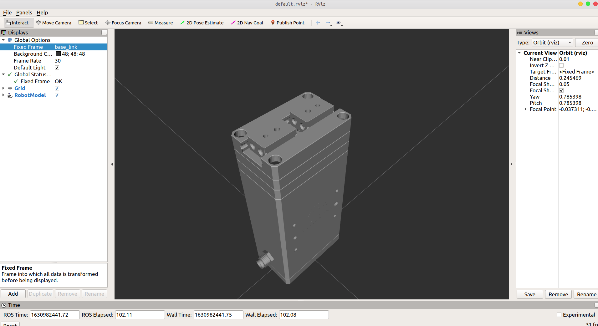
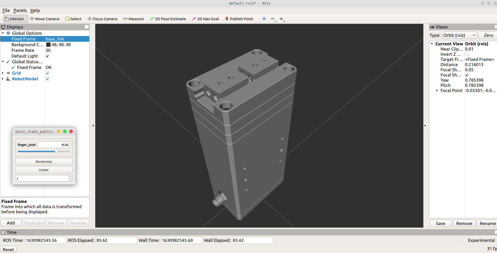

 [English](./README.md) | 简体中文

# 说明

## Tips

> 1. Rviz中使用 **joint-state-publisher-gui** 发布 **'/joint_states'** 的话题，通过节点来订阅此话题来实现实物与模型的同步
> 2. 如果没有显示找不到 **joint-state-publisher-gui** ，在终端中通过以下命令进行安装。
```bash
sudo apt-get install ros-melodic-joint-state-publisher-gui
```

## 环境配置

1. ubuntu18.04系统

2. ros-melodic环境

3. 把**crt_ctpm14_gripper_visualization**文件包拷贝到ubuntu系统工作空间的src文件夹下，执行如下语句：
```bash
cd ~/catkin_ws/
```
```bash
catkin_make
```
编译完成再执行如下语句：
```bash
source ~/catkin_ws/devel/setup.bash
```

## 运行程序

* 使用rviz显示平动手URDF模型，需执行的命令及结果图如下所示。
```bash
roslaunch crt_ctpm14_gripper_visualization display.launch
```



<center>图1 RViz显示平动手URDF模型</center>

* 使用rviz显示平动手URDF模型并拖拽rviz滑条，即可使平动手模型双指同步运动。
```bash
roslaunch crt_ctpm14_gripper_visualization crt_ctpm14_display.launch
```



<center>图2 RViz中控制平动手模型运动</center>


